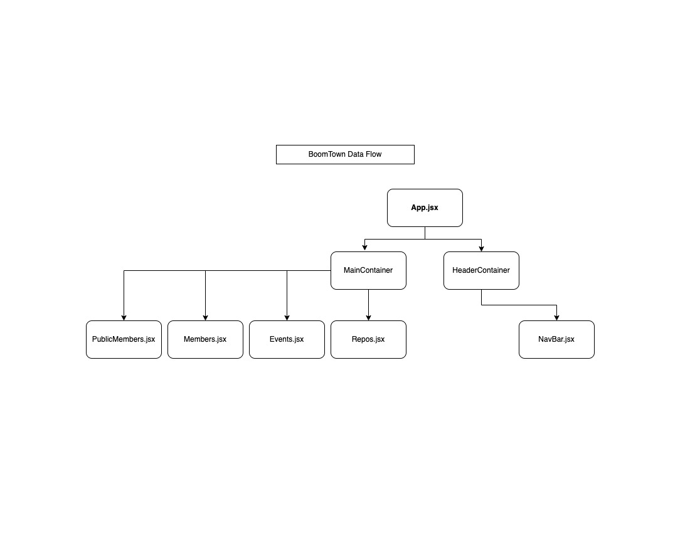

<h1 align="center">
  <br>
    
    <br>
    <br>
  BoomTown Take Home Assessment
</h1>

## Description

I felt that this assessment had some challenges, but I felt I was able to do most of what was expected of me. The assessment itself was in my opinion worded a bit ambiguously, I interpreted this as an opportunity to essentially fetch data and display it in any manner I saw fit. 

My overall plan as you can see in the Compontn Flow diagram was to essentially just call the initial data within the MainContainer.jsx file and prop drill down any other top level URLs needed to fetch the necessary data for each particular component. 

You will notice that each functional component has had its respective URL prop drilled down from the initial MainContainer data fetch call, essentially allowing for very simple and efficient modularity through the entire application. I saw that both the Hooks URL and the Issues URL returned no data, so I did not create respective components for them. 

In terms of overall component layout I kept it very simple, and just initalized simple boolean states within each respective component that returned data within its own fetch call. The data itself will appear from very simple button clicks and will disappear if you click the button again. 

I used a very simple SCSS layout, and did very minor CSS changes to each list of data, giving them just simple borders and ensuring that the li elements within each ul appeared orderly and clean. I also borrowed some Material UI buttons as I really like the Google colors and aesthetic. 

I unfortunately became ill right when I received the take home and had some difficulty focusing, so I apologize in advance for any simple mistakes, as always grateful for the opportunity, and thank you! 

<br>

## Component Flow



<br>

## Getting Started

### Clone this repository
```bash
git clone https://github.com/codejunkie7/boomtown.git
```

### Install dependencies
```bash
npm install
```

### Run in development
```bash
npm run dev
```

